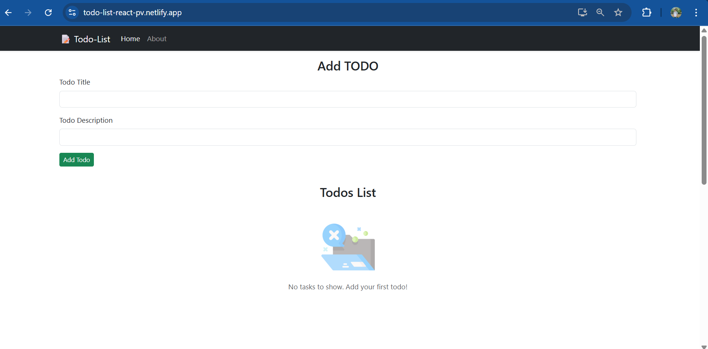

<h1 align="center">📋 React Todo List App</h1>

<p align="center">
  Built using React, Bootstrap, and localStorage. Simple, fast, and fully responsive.
</p>

<p align="center">
  
  
  
  <br/>
  <a href="https://app.netlify.com/projects/todo-list-react-pv/deploys">

  </a>
</p>


---

## 🔗 Live Demo

👉 [View Live App on Netlify](https://todo-list-react-pv.netlify.app)

---

## ✅ Features

- ➕ Add todos with title and description
- ✅ Mark tasks as completed with a checkbox
- ❌ Delete tasks
- 💾 Store todos in localStorage so they persist after refresh
- 📦 Navigate using React Router (Home / About pages)
- 💡 Responsive, clean UI with Bootstrap 5

---

## 📸 Screenshot



---

## 🚀 Tech Stack

- **React JS**
- **Bootstrap 5**
- **React Router DOM v6**
- **LocalStorage**
- **Netlify (Deployment)**

---

## 🛠️ Getting Started

To run this project locally:

```bash
# Clone the repository
git clone https://github.com/prajwal-pv/todo-list-react.git

# Navigate into the project directory
cd todo-list-react

# Install dependencies
npm install

# Start the local development server
npm start

```
---

## 📄 License

This project is licensed under the [MIT License](LICENSE).

---

<p align="center">Made with ❤️ by <strong>Prajwal Vithale</strong></p>

